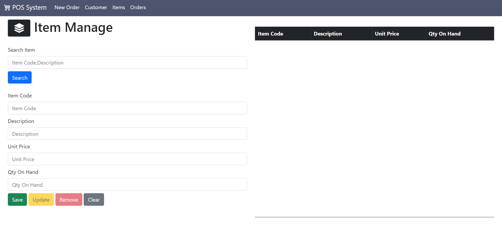

Point Of Sales System UI interfaces created by using CSS framework(Bootstrap).

:link: <a href="https://tharindulala.github.io/WebPos/index.html" target="_blank">Click Here to Github Pages</a>

## This is preview
 
 
 